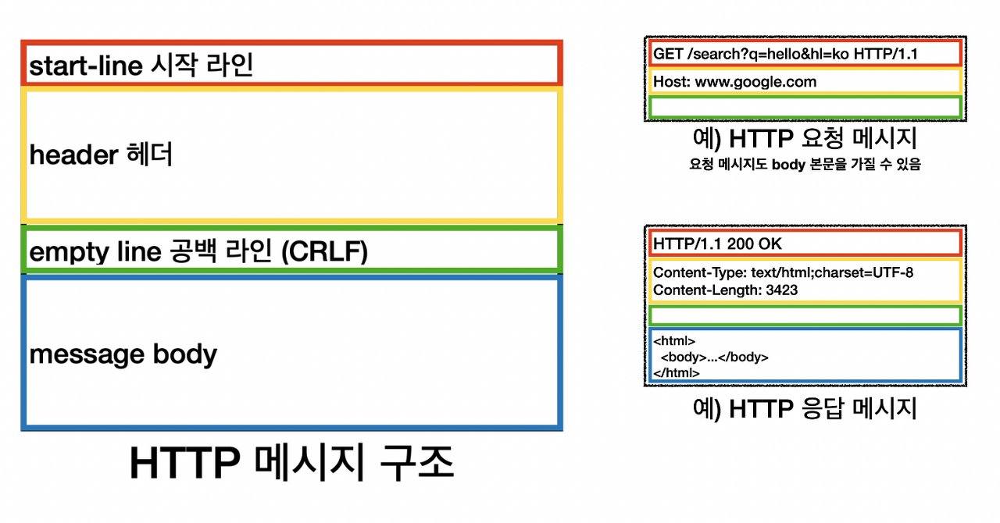
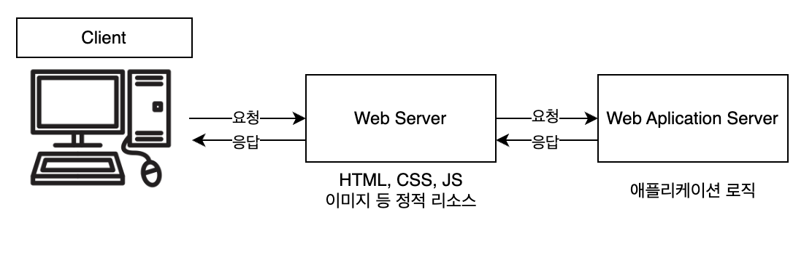
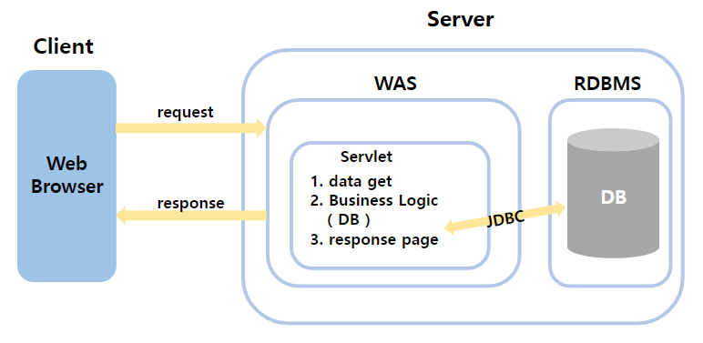

# Servlet

## Servlet이란?

클라이언트(웹 브라우저)의 요청을 처리하고, 그 결과를 반환하는 Servlet 클래스의 구현 규칙을 지킨 자바 웹 프로그래밍 기술이다. 간단히 말하자면 자바를 사용하여 웹을 만들기 위한 기술로 자바 코드 안에 HTML 코드가 들어 있다. 

좀 더 구체적으로 설명하면 서블릿은 웹 서버에 배치되어 HTTP 프로토콜을 통해 클라이언트 요청을 받고, 자바 코드를 이용해 동적인 웹 페이지를 생성하거나 데이터를 처리하고 응답을 반환한다.

## 웹 HTTP란?

클라이언트와 서버가 데이터를 주고 받을 때 사용하는 인터넷 규약으로 서버와 서버가 데이터를 주고 받을 때도 쓰며, HTML, TEXT, 이미지, 음성, JSON, XML 등 거의 모든 형태의 데이터를 전송 가능하다.

위의 이미지는 가장 기본적인 웹 동작흐름이다.

## Servlet의 특징

- 클라이언트의 요청에 대해 동적으로 작동하는 웹 어플리케이션 컴포넌트
- html을 사용하여 요청에 응답한다.
- Java Thread를 이용하여 동작한다.
- MVC 패턴에서 Controller로 이용한다.
- HTTP 프로토콜 서비스를 지원하는 javax.servlet.http.HttpServlet 클래스를 상속받는다.
- UDP보다 처리 속도가 느리다.
- HTML 변경 시 Servlet을 재컴파일해야 하는 단점이 있다.

## Servlet의 동작 방식

1. 사용자가 URL을 입력하면 Http Request가 Servlet Container로 전송된다.
2. 요청을 받은 Servlet Container가 HttpRequest, HttpResponse 객체를 생성한다.
3. Web.xml을 기반으로 사용자가 요청한 URL이 어느 서블릿에 대한 요청인지 찾는다.
4. 해당 서블릿에서 service 메소드를 호출한 후, 클라이언트의 GET, POST 여부에 따라 doGet()이나 doPost()를 호출한다.
5. doGet()이나 doPost() 메소드는 동적 페이지를 생성한 후 HttpResponse 객체에 응답을 보낸다.
6. 응답이 끝나면 HttpRequest와 HttpResponse 객체를 소멸시킨다.

## Servlet Container란?

간단히 말해 서블릿을 관리해주는 컨테이너이다. 우리가 서버에 서블릿을 만들었다고 해서 스스로 동작하는 것이 아니기 때문에 이를 관리해줄 필요가 있는데 그러한 역할을 해준다. 서블릿 컨테이너는 클라이언트의 요청을 받아주고 응답을 할 수 있게 웹 서버와 소켓으로 통신하며 대표적으로는 TomCat이 있다.

## Servlet Container의 역할

1. 웹 서버와의 통신 지원
2. 서블릿의 생명주기 관리(init(), doGet(), doPost(), service(), destroy())
3. 멀티 쓰레드 지원 및 관리
4. 선언적인 보안 관리